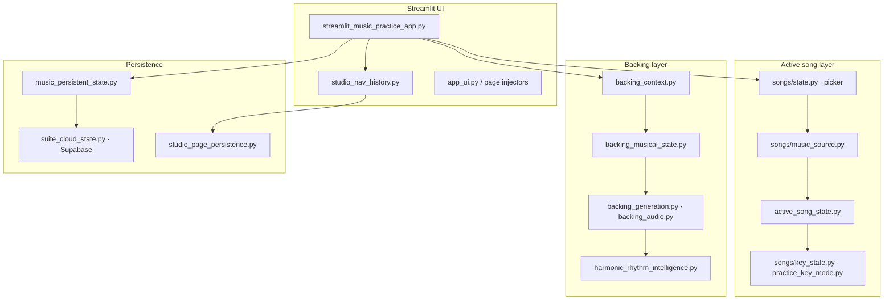

# AI Music Practice Coach

**AI Music Practice Coach** is a song-aware practice studio for working musicians and serious students — guitarists, horn players, vocalists, and multi-instrumentalists who want one place to rehearse, not a pile of disconnected apps. Pick a song from a curated catalog, a custom progression, or a creative jam, then move through chord charts, section-focused practice, backing-track generation, improvisation labs, recording analysis, and AI coaching without re-entering keys or song context. The app maintains a single **active song** and unified musical state (concert key, written key, guitar shape, fixed practice key family) across nine studio pages, with optional cloud restore so you can resume the same session on another device.

Built as part of the **Daniel Cohen AI Suite** (shared workspace auth, cloud persistence, and Command Center handoffs). Daily development happens on branch `dev`; production `main` may lag behind.

---

## At a glance (portfolio overview)

| | |
|---|---|
| **Role** | Full-stack Python application — product logic, audio synthesis, persistence, and test-heavy state management |
| **Stack** | Python 3 · Streamlit · NumPy/SciPy · librosa · custom WAV backing engine · optional Supabase · optional OpenAI |
| **Scale** | 300+ Python modules · **1,242 automated tests** · curated multi-genre song catalog with verified chord charts |
| **Differentiators** | Section-aware practice tied to real songs; concert vs written vs guitar-shape key model; backing context that follows catalog, custom, and creative sources; cross-device session restore with acceptance-tested persistence |

---

## Why this project is different

Most music apps solve **one** problem well:

- a metronome
- a tuner
- backing tracks
- chord charts
- recording analysis

**AI Music Practice Coach** combines all of them into **one song-aware workflow**. When you change the practice key, switch sections, or jump from Practice to Backing to Creative Lab, the app already knows which song you are working on and keeps keys, charts, and audio aligned.

What makes that possible:

- **Active song architecture** — one canonical song identity (catalog, custom, or creative) drives every studio page.
- **Practice → backing → creative → analysis continuity** — handoffs preserve sections, groove, harmonic rhythm, and backing context instead of starting over.
- **Unified key system** — concert pitch, written key for transposing instruments, guitar shape with capo, and optional fixed practice key family resolve through shared resolvers.
- **Cross-device persistence** — globals, page snapshots, and canonical flush modules autosave locally and optionally to Supabase; manual Tests A–E verify restore behavior on `dev`.

---

## Notable engineering challenges

These are the problems that shaped the architecture — useful context for portfolio or technical review:

| Challenge | What it involves |
|-----------|------------------|
| **Cross-device persistence and cloud restore** | Merging local disk envelopes with Supabase workspace state without clobbering live edits; acceptance Tests A–E frozen on `dev`. |
| **Active Song synchronization across nine studio pages** | One `pick_key` and music source must stay authoritative while each page owns local UI snapshots. |
| **Concert Key vs Written Key vs Guitar Shape Key resolution** | Three parallel key views for charts, sidebar, and backing — centralized in `resolve_active_musical_key` and `resolve_current_backing_musical_state`. |
| **Fixed Practice Key Family mode** | Session-wide major/minor family remaps every song source (catalog, custom, creative, backing) while preserving enharmonic spelling. |
| **Backing-track generation with Harmonic Rhythm Intelligence** | Bar-level WAV synthesis with pushes, subdivisions, and optional HRI humanization from real chart timing. |
| **Creative → Practice → Backing handoffs** | Creative jams, missions, and CPL progressions each carry distinct backing context into Backing Studio. |
| **Large-scale Streamlit state management** | Hundreds of session keys, page-local history stacks, and deferred saves without routing or restore regressions. |
| **Multi-source ownership** | Catalog, Custom, and Creative sources compete for transport authority; `music_source_ownership.py` coordinates activation and key resets. |

Module-level detail, persistence internals, and test commands: **[docs/ARCHITECTURE.md](docs/ARCHITECTURE.md)**.

---

## Screenshots

> Add captures under `docs/screenshots/` (see [docs/PORTFOLIO_SCREENSHOT_GUIDE.md](docs/PORTFOLIO_SCREENSHOT_GUIDE.md)). Enable **Portfolio Screenshot Mode** in the sidebar before shooting.

| | |
|---|---|
|  | **Song Selection** — curated catalog, filters, favorites, active song hub |
|  | **Practice** — Control Center, section focus, chart/TAB, lyrics, tuner |
|  | **Backing Studio** — scope, BPM/groove, generated WAV, live chord timeline |
|  | **Creative Lab** — style jam, improvisation intelligence, harmony tools |
|  | **Custom Progression** — build-by-click progressions saved as custom songs |
|  | **Practice Log** — session history, filters, AMI synthesis handoff |

*Placeholder paths above — replace with real assets when publishing the portfolio.*

---

## What musicians use it for

1. **Pick a song** from the curated catalog, your custom progression, or a creative jam.
2. **Set up practice** — instrument, level, focus, and how keys should behave (per-song or fixed family).
3. **Practice** with section-focused charts, metronome, lyrics, transposition, and tuner.
4. **Generate backing** matched to the active song’s sections, groove, and harmonic feel.
5. **Improvise and analyze** in Creative Lab; record and score takes on Upload/Multitrack.
6. **Log sessions** and run **Analyze My Practice** for a synthesized progress report.
7. **Resume anywhere** — optional cloud sync restores page, song, keys, and backing state across devices.

---

## Studio pages

Nine pages share one sidebar (instrument, level, focus, keys) and one **active song** context.

| Page ID | UI label | Purpose |
|---------|----------|---------|
| `picker` | Song Selection | Catalog search, filters, favorites, lyrics/cues editor, chart overrides, karaoke setlist |
| `practice` | Practice | Control Center, coach/timing/chart/lyrics/transpose/tuner tabs |
| `backing` | Backing Track | Section scope, BPM/groove/meter, WAV generation, chord follow-along |
| `custom` | Custom Progression | Custom Progression Lab — build and save progressions as custom songs |
| `creative` | Creative Lab | Improvisation Intelligence — jams, missions, harmony map, deep analysis |
| `multitrack` | Multitrack | Layered recording mixer, count-in, export |
| `analysis` | Upload Analysis | Single-file recording analysis, mission scoring, coach report |
| `log` | Practice Log | Quick-save sessions, search/filter, AMI handoff |
| `openai` | OpenAI | Coaching hub (API key required; several cards still expanding) |

**Navigation:** collapsible sidebar **Pages** menu, floating **← Back / Forward →** history (page-local UI only — globals like song and key are preserved). First-run tutorial (`app_tutorial.py`).

---

## Key features

### Catalog songs

- Curated library across Jazz, Pop, Rock, Funk, Blues, Jewish, Classical, and more (`song_catalog/curated_songs.py`).
- Verified bar-level charts (beginner / intermediate / advanced), lyric cues, guitar TAB hints, arrangement notes.
- Search by title, artist, genre, style, level; developer filters for chart status.
- Per-user chart overrides and lyrics editor (`song_chart_editor.py`, `song_catalog/user_overrides.py`).
- **Active Song Hub** on Song Selection: Practice, Backing, Karaoke (voice), favorites, edit chart.

### Custom songs

- **Custom Progression Lab** (`custom_progression_lab.py`, `cpl_page_ui.py`): section builder, chord subdivisions, pushes, saved progressions.
- Custom sources participate in practice, backing, and persistence the same way catalog songs do (`songs/music_source.py`, `active_song_state.py`).

### Creative page

- **Improvisation Intelligence** (`improvisation_intelligence_ui.py`): Entry & Jam, Style Jam, Jam Session Generator, Song-Based Improvisation, Live Coach, Phrase/Motif tools, Missions, Harmony Map, Deep Harmonic Analyzer.
- Creative jams hand off to Backing Studio with their own backing context (`backing_context.py`, `open_backing_from_creative`).

### Practice page

- **Practice Control Center** — groove, session length, key behavior (standard vs fixed family).
- Tabs: **Coach** (scales, exercises, chord coach), **Timing** (metronome, section loop), **Chart/TAB**, **Lyrics** (YouTube panel, lyric-chord sheets), **Transpose/Instrument**, **Tone/Tuner**.
- Adaptive practice sheet from catalog, upload analysis, or fallback progression.
- Section Focus jump bar with handoff to Backing.

### Backing Studio

- Full song, single section, or multi-section loop scope.
- BPM, groove style, time signature; canonical defaults per song (`songs/playback_defaults.py`).
- **Harmonic Rhythm Intelligence (HRI)** — optional humanization of chord entry timing (`harmonic_rhythm_intelligence.py`); charts can also encode explicit pushes (`chord_subdivisions.py`, e.g. `G:3.5|C:0.5p`).
- WAV synthesis (`backing_audio.py`, `backing_generation.py`), session cache, inline player, live chord follow-along timeline.
- Backing source banner shows catalog, custom, or creative context with resolved concert key and guitar-shape badge (`backing_context_ui.py`, `backing_musical_state.py`).

### Fixed Practice Key mode

- Practice-page setup: **use each song’s original key** vs **use one key family for this session** (`practice_key_mode.py`).
- 20 major/minor family pairs with enharmonic spelling preserved (e.g. E major / Db minor).
- Fixed family applies across catalog, custom, creative, and backing paths; sidebar quick-disable checkbox when active.
- Per-song saved keys are ignored while fixed mode is on.

### Instrument transposition

- Concert **Practice Key** vs **written key** for saxophone, trumpet, clarinet, and more (`instrument_transposition.py`).
- “Show chart in written key” toggle; chart badge shows written key when it differs from concert.
- Transposing subtype persisted and restored cross-device (Test D/E acceptance).

### Guitar shape mode

- Capo helper: **guitar shape key** vs concert sounding key (`guitar_capo.py`).
- Charts and backing follow shape when capo is enabled; badge reads “Guitar shape F” while concert stays C.

### Lyrics / Karaoke

- Lyric-chord charts for select catalog songs (`song_catalog/lyric_chord_charts.py`).
- User lyrics and cues editor on Song Selection.
- **Karaoke Performance Setlist** (voice instrument): queue songs, auto-generate backing, auto-advance, countdown, lyric-focused styling (`karaoke_ui.py`, `karaoke_mode.py`).
- Vocal pitch scoring is stubbed — real-time scoring is on the roadmap.

### Tone & tuner

- Practice page **Tone/Tuner** tab: sustain analysis, stability metrics (`tuner_tone_ui.py`, `tuner_live.py`).
- **Tone take history** — save takes per instrument, lazy audio playback, tombstone sync (`media_tone_catalog.py`).

### Practice analytics

- **Practice Log** — quick save with instrument, keys, focus, song metadata (`practice_log_state.py`).
- Search/filter; refresh and delete with local + cloud persistence.
- **Analyze My Practice** — 10-section local progress report synthesizing logs, upload analyses, tone takes, and export metadata (`practice_history_synthesis.py`, `music_ami_instant_solver.py`).

### AI coaching

- **OpenAI** page hub; context promotion per studio page (`music_ami_pages.py`, `music_coach_context.py`).
- Practice Log → Command Center **Music Practice Log Analysis** handoff.
- Instant solver route for offline-style reports; full OpenAI cards still expanding.

---

## Key concepts — how keys work

The app deliberately separates **concert pitch** (what the band hears) from **what you read or finger** on your instrument.

| Term | Meaning |
|------|---------|
| **Original key** | The song’s home key as published in the catalog (e.g. Say in **G**). Shown in the sidebar as *Song Original Key*. |
| **Practice concert key** | The concert pitch you are practicing in today — may differ from original after transposition. Sidebar **Practice / Concert Key** (hidden when Fixed mode is on). Drives backing audio and chart transpose. |
| **Written key** | For transposing instruments (alto sax, Bb trumpet, etc.): the key shown on your part when “chart in written key” is on. Derived from concert key + instrument interval. |
| **Guitar shape key** | With capo enabled: the chord shapes you finger, while the sounding concert key stays on the practice concert key. |
| **Fixed practice key family** | Session mode: pick a major/minor pair (e.g. **G major / E minor**). Major songs map to the major side; minor songs to the minor side, preserving your chosen spelling. |

**Resolver chain:** `resolve_active_musical_key` (practice/charts) and `resolve_current_backing_musical_state` (backing/creative) centralize these values so the sidebar, blue active-song card, backing source banner, and follow-along timeline stay aligned.

---

## Architecture (high level)

The app is a single Streamlit shell that routes nine studio pages through shared session state. One active song flows from Song Selection through practice charts, backing synthesis, creative labs, and analysis — with centralized key resolvers and persistence so UI, audio, and cloud restore stay in sync.



**Persistence (summary):** globals (song, keys, instrument) survive page changes; page-local snapshots restore tabs and backing scope on back/forward; canonical modules flush edits to disk and optional cloud. Manual acceptance **Tests A–E** are passed and frozen on `dev`.

For the module map, resolver table, persistence internals, repository layout, and test commands, see **[docs/ARCHITECTURE.md](docs/ARCHITECTURE.md)**.

---

## Setup & install

### Prerequisites

- Python 3.10+ recommended
- `ffmpeg` available on PATH (via `imageio-ffmpeg` for some media paths)

### Local run

```bash
git clone https://github.com/Coakley11/ai-music-practice-coach.git
cd ai-music-practice-coach
git checkout dev

python -m venv .venv
# Windows
.venv\Scripts\activate
# macOS/Linux
source .venv/bin/activate

pip install -r requirements.txt
streamlit run streamlit_music_practice_app.py
```

Open the URL Streamlit prints (usually `http://localhost:8501`).

### Optional configuration

| Feature | Configuration |
|---------|----------------|
| **Cloud persistence** | Supabase env vars (see `suite_storage_config.py`, `suite_cloud_state.py`) |
| **OpenAI coaching** | API key via app secrets / `openai_secrets_config.py` |
| **Suite auth** | Real Accounts gate via `suite_auth.py` when enabled |
| **Developer diagnostics** | `?dev=1` query param |

### Development workflow

- Work on **`dev`**, push to **`origin/dev`** (Streamlit Cloud dev app).
- One-time: `.\scripts\setup-dev-git.ps1` (Windows) — hooks + upstream.
- Push: `.\scripts\push-dev.ps1` or `git push origin dev`.
- Details: [docs/DEV_WORKFLOW.md](docs/DEV_WORKFLOW.md).

---

## Roadmap

Planning docs live in [`cursor-prompts/`](cursor-prompts/):

| Doc | Contents |
|-----|----------|
| [music_app_roadmap.md](cursor-prompts/music_app_roadmap.md) | Master status and milestones |
| [music_app_tasks.md](cursor-prompts/music_app_tasks.md) | Active priorities |
| [music_app_feature_backlog.md](cursor-prompts/music_app_feature_backlog.md) | Queued ideas |
| [music_app_completed_features.md](cursor-prompts/music_app_completed_features.md) | Shipped capabilities |

### Near term (from current backlog)

- **P0 — Uploads & Multitrack persistence** — dedicated media channel, Supabase Storage refs, cross-device sync ([plan](cursor-prompts/plans/2026-06-27-uploads-multitrack-persistence-sprint.md)).
- **P1 — UI polish** — page headers, icons, Practice layout, written-key badges ([plan](cursor-prompts/plans/2026-06-09-ui-polish-phase.md)).
- **P2 — Back/Forward nav audit** — verify history stacks after architecture changes.
- Karaoke **real-time pitch scoring** (stubs exist).
- **OpenAI hub** expansion — active-song coach, session plans from logs.
- Section Focus label → chart section key auto-mapping.
- Production merge `dev` → `main` when navigation UI and persistence are stable.

### Longer term

- Stem export from backing engine; tap-tempo BPM detect.
- Playlist folders, ChordPro/MusicXML bulk import.
- Gig setlists beyond karaoke queue.
- Chart simplification / reharmonization suggestions (beginner mode).

---

## License & attribution

Daniel Cohen AI Music Practice Coach — portfolio / educational project. Song charts represent harmonic practice material; verify against official publications for performance use.

---

## Related documentation

- [Architecture reference](docs/ARCHITECTURE.md)
- [Development workflow](docs/DEV_WORKFLOW.md)
- [Persistence baseline (Tests A–E)](docs/MUSIC_PERSISTENCE_BASELINE.md)
- [Portfolio screenshot guide](docs/PORTFOLIO_SCREENSHOT_GUIDE.md)
- [Phase C persistence protocol](docs/MUSIC_PHASE_C_PROTOCOL.md)
