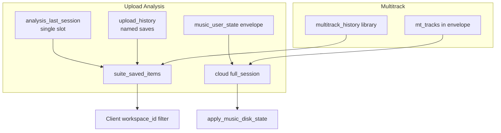

# Sprint: Uploads + Multitrack persistence, cross-device sync, AMI integration

**Last updated:** 2026-06-27  
**Branch:** `dev`  
**Status:** Audit complete → implementation queued  
**Baseline:** Practice Log v1 (quick save, refresh/delete persistence, search/filter, instrument/key labels, AMI handoff title) is working.

---

## Goal

Uploads and Multitrack become **persistent, cross-device music memory** — same reliability bar as Practice Log:

| Action | Expected |
|--------|----------|
| Upload on phone | Appears on Dell (metadata + analysis; audio when storage wired) |
| Upload on Dell | Appears on phone |
| Save multitrack on phone | Appears on Dell |
| Save multitrack on Dell | Appears on phone |
| Delete on either device | Stays deleted (tombstone sync) |
| Refresh / Streamlit rebuild | Items survive |
| Analyze My Practice | AMI receives practice logs **+** upload/multitrack summaries |

**Non-goals this sprint:** Reopen Tests A–E restore architecture; embed multi-MiB audio in workspace envelope; send raw audio to AMI.

---

## Step A — Audit summary

### A1. Upload Analysis (single-file path)

| Layer | Module | Storage | Scope | Audio blobs? |
|-------|--------|---------|-------|--------------|
| **Last session auto-restore** | `analysis_session_persistence.py` | Local `data/workspaces/{ws}/analysis_last_session.json` + Supabase `saved_item` (`item_type=analysis_last_session`, `item_key=last`) | Single slot, overwritten each analysis | Full audio b64, **no size cap** in this layer |
| **Upload History library** | `upload_history.py` → `studio_history_cloud.py` | Supabase `suite_saved_items` only (`item_type=upload_history`) | Named saves, workspace-filtered client-side | Only if ≤ **512 KB** (`MAX_EMBED_AUDIO_BYTES`); else metadata-only |
| **Workspace envelope** | `music_persistent_state.py` `_PERSIST_KEYS` | `music_user_state.json` + cloud `metrics.full_session` | `last_analysis_*` ride along with full app state | Same bytes as session; not a dedicated media catalog |

**UI / pipeline**

- Page: `streamlit_music_practice_app.py` (`_studio_page == "analysis"`, ~L11950+)
- Prep: `upload_media.py` (`prepare_upload_for_analysis`, ffmpeg video→WAV)
- Analysis: `recording_analysis.py`, display `recording_analysis_ui.py`
- History panel: `studio_history_ui.py` → `render_upload_history_panel`
- Activity: `music_activity.py` (`log_media_upload`)

**Delete:** `studio_history_cloud.delete_history_item` → `suite_account.forget_saved_item` (soft `valid=False`). Last-session clear via `clear_analysis_session()`.

**Restore on refresh:** `restore_analysis_session()` (cloud → local) on page entry; `apply_pending_upload_history()` for queued loads.

**Video:** Never persisted — temp ffmpeg extract only.

### A2. Multitrack path

| Layer | Module | Storage | Scope | Audio blobs? |
|-------|--------|---------|-------|--------------|
| **Working session** | `streamlit_music_practice_app.py` multitrack page | `session_state`: `mt_tracks`, `mt_track_filenames`, `mt_track_controls`, `mixed_track_wav` | Live mixer | Raw bytes in memory |
| **Session persist** | `multitrack_session_persistence.py` | Encoded in `music_user_state.json` / cloud full_session via `_PERSIST_KEYS` + page snapshot | Cross-refresh on same device | Per-track cap **2 MiB**, mix **2.5 MiB**; oversize → `None` |
| **Project Library** | `multitrack_history.py` → `studio_history_cloud.py` | Supabase `item_type=multitrack_history` | Named projects | Per-track **256 KB**, total **512 KB** embed budget |

**UI:** Multitrack page ~L12543+; history `render_multitrack_history_panel` in `studio_history_ui.py`.

**Delete:** History row delete via `forget_saved_item`; "Clear all layers" clears session only (may not force-save — gap).

### A3. What actually syncs phone ↔ Dell today



**Blockers for true cross-device media memory:**

1. **No blob store** — audio is base64 inside JSON rows; normal WAV clips exceed 512 KB caps → **metadata-only on remote device**.
2. **Upload History is cloud-only** — no local fallback file; offline / unsigned-in = no library.
3. **Three overlapping stores** — last-session, history library, workspace envelope; no unified catalog or tombstone merge.
4. **Workspace filter is client-side** — `studio_history_cloud._workspace_rows()`; depends on stable `workspace_id` in payload.
5. **Multitrack control key mismatch** — live `mt_track_controls` keyed by layer_name; history builder reads `controls.get(slot)` → mute/volume may not round-trip after rename.
6. **Duplicate slot constants** — `MULTITRACK_SLOTS` vs `MT_SLOTS` — drift risk.
7. **Clear-all / empty cloud** — no Practice-Log-style "empty cloud must not wipe local" guard for media metadata.

### A4. AMI integration today

**Handoff:** `practice_log_ui.py` → `submit_analyze_practice_to_ami` → `build_practice_log_ami_payload` (`practice_log_ami.py`).

**Currently sent:**

```python
{
  "practice_log_summary": {...},
  "recent_sessions": [...],           # up to 30 compact sessions
  "active_song_context": {...},
  "recording_analysis_context": [...], # last 8 from ai_performance_history (narrow fields)
  "user_request": "analyze_practice",
}
```

**`recording_analysis_context` fields:** date, song, instrument, weakest/strongest category, next_focus, coach_summary (truncated).

**NOT sent (but modules exist):**

- `upload_history.py` library rows (`list_history_items(item_type="upload_history")`)
- `multitrack_history.py` library rows
- Full scores, mission_results, tempo, layer_scores from analysis
- Linked practice session ids

**AMI solver:** `Applied-mathematical-intelligence/components/music_ami_solvers.py` `_practice_log_analysis_result` — now renders rich text from `practice_log_summary` + sessions; **does not yet reference upload/multitrack lists**.

---

## Step B — Canonical media model

**Rule:** Do **not** put raw audio/video blobs in `music_user_state.json` / full_session envelope. Use **metadata saved_items + external blob storage**.

### B1. `uploaded_recordings` (metadata record)

```json
{
  "recording_id": "uuid",
  "created_at": "ISO8601",
  "updated_at": "ISO8601",
  "workspace_id": "daniel",
  "source_device": "optional-device-id",
  "filename": "say_take1.wav",
  "media_type": "audio",
  "mime_type": "audio/wav",
  "duration_seconds": 42,
  "song": "Say",
  "instrument": "Tenor Saxophone",
  "practice_concert_key": "G",
  "written_key": "A",
  "shape_key": "",
  "original_key": "G",
  "bpm": 92,
  "bpm_source": "backing_track",
  "storage_ref": "supabase://music-media/{user}/{ws}/recordings/{recording_id}.wav",
  "analysis_summary": {
    "coach_summary": "...",
    "scores": {"timing": 7, "tone": 6},
    "weakest_category": "timing",
    "strongest_category": "tone",
    "practice_plan": "..."
  },
  "notes": "",
  "linked_practice_session_id": "optional",
  "deleted": false
}
```

### B2. `multitrack_sessions` (metadata record)

```json
{
  "multitrack_id": "uuid",
  "created_at": "ISO8601",
  "updated_at": "ISO8601",
  "workspace_id": "daniel",
  "title": "Say — 3 layers",
  "song": "Say",
  "instrument": "Tenor Saxophone",
  "bpm": 92,
  "practice_concert_key": "G",
  "original_key": "G",
  "tracks": [
    {
      "track_id": "uuid",
      "slot": "Sax / winds",
      "name": "Take 1",
      "instrument": "Tenor Saxophone",
      "storage_ref": "supabase://.../tracks/{track_id}.wav",
      "duration_seconds": 30,
      "created_at": "ISO8601",
      "volume": 1.0,
      "delay": 0.0,
      "analysis_summary": {}
    }
  ],
  "mixed_preview_ref": "optional",
  "notes": "",
  "deleted": false
}
```

### B3. Storage channel layout (new module: `media_persistence.py`)

| Channel | Purpose |
|---------|---------|
| **Supabase `saved_item`** | `item_type=uploaded_recordings` / `multitrack_sessions` — workspace-scoped list payloads (metadata + tombstones), mirror Practice Log pattern |
| **Local JSON cache** | `data/workspaces/{ws}/uploaded_recordings.json`, `multitrack_sessions.json` — merge cache, survives offline |
| **Supabase Storage bucket** (new) | `music-media/{user_id}/{workspace_id}/...` — actual WAV blobs; `storage_ref` pointer in metadata |
| **Legacy migration** | Import rows from `upload_history` + `multitrack_history` + `analysis_last_session` without deleting sources until verified |

**Merge rules** (copy from `practice_log_persistence.py`):

- Cloud authoritative when configured
- Merge by `recording_id` / `multitrack_id` + `updated_at`
- Tombstones win over visible rows
- Empty cloud **must not** wipe non-empty local without tombstone proof
- Legacy local-only rows preserved until explicit delete

---

## Step C — Upload persistence + sync

1. Add `media_persistence.py` + `media_state.py` (normalize, tombstone, merge, compact AMI export).
2. On analysis complete: auto-upsert `uploaded_recordings` row (not only manual "Save to History").
3. Upload blob to Supabase Storage when configured; else local file under workspace media dir + relative `storage_ref`.
4. Wire delete → tombstone + optional storage object delete.
5. Deprecate dual paths gradually: keep `analysis_last_session` for "resume last analysis UI" but catalog is source of truth for cross-device list.
6. Migrate `upload_history` payloads → canonical shape on first load.

---

## Step D — Multitrack persistence + sync

1. On "Save project" / auto-save hook: upsert `multitrack_sessions` with per-track `storage_ref`s.
2. Fix `mt_track_controls` slot vs layer_name mapping in `build_multitrack_history_payload`.
3. Unify `MULTITRACK_SLOTS` / `MT_SLOTS` → single import.
4. Force-save after "Clear all layers" with tombstone or explicit empty state.
5. Remove reliance on embedding audio in JSON for cross-device; use storage refs.
6. Migrate `multitrack_history` → canonical shape.

---

## Step E — AMI integration

Extend `build_practice_log_ami_payload`:

```python
{
  "practice_log_summary": {...},
  "recent_sessions": [...],
  "uploaded_recordings": [...],      # compact: id, date, song, instrument, duration, keys, bpm, analysis_summary, notes
  "multitrack_sessions": [...],      # compact: id, title, song, track names, analysis summaries
  "recording_analysis_context": [...], # widen OR dedupe against uploaded_recordings
  "active_song_context": {...},
}
```

**Exclude:** `deleted: true`, raw b64, blobs.

**AMI solver** (`music_ami_solvers.py`): add sections when lists non-empty:

- "You logged N sessions and uploaded M takes of {song}."
- Instrument / focus patterns from recordings
- "Compare Take 2 vs Take 3" when multiple uploads same song

---

## Step F — UI + diagnostics

**Uploads page**

- List persisted `uploaded_recordings` after refresh (date, song, instrument, duration, analysis status)
- Delete, edit notes, optional link to practice session id
- Show analysis status badge (analyzed / pending / failed)

**Multitrack page**

- List saved `multitrack_sessions`; open / delete
- Survive refresh; sync indicator when cloud pending

**`?dev=1` diagnostics** (Upload + Multitrack pages, mirror Practice Log panel):

- `workspace_id`
- local media path
- cloud metadata count / local metadata count
- `uploaded_recordings` count / `multitrack_sessions` count
- last save ok/error, last load ok/error
- storage upload ok/error
- tombstone count
- deploy commit

---

## Step G — Tests

| Test | Module |
|------|--------|
| Upload metadata save/reload | `tests/test_media_persistence_upload.py` |
| Upload phone + Dell merge | merge fixture: local + cloud rows |
| Upload delete tombstone | delete on A visible on B as gone |
| Multitrack save/reload | `tests/test_media_persistence_multitrack.py` |
| Multitrack merge + delete tombstone | same pattern |
| Workspace isolation | daniel vs ariel |
| Empty cloud does not wipe local | guard test |
| AMI payload includes recordings + multitrack | `tests/test_practice_log_ami.py` |
| AMI payload excludes deleted media | tombstone filter |
| Legacy migration | import `upload_history` row shape |

**Commit strategy:** Separate commits per step (C, D, E, F) after tests pass — do not mix with UI polish or Practice Log changes.

---

## Implementation order

| Step | Deliverable | Est. |
|------|-------------|------|
| **A** | This audit doc | ✅ Done |
| **B** | `media_state.py`, `media_persistence.py` schemas + merge | 4–6h |
| **C** | Upload auto-catalog + storage refs + migration | 6–10h |
| **D** | Multitrack catalog + slot fix + storage refs | 6–10h |
| **E** | AMI payload + solver sections | 3–5h |
| **F** | UI lists + dev diagnostics | 4–6h |
| **G** | Test suite + focused commits | 4–6h |

**Prerequisite:** Confirm Supabase Storage bucket + RLS policy (or fallback local-only blob dir with metadata sync only).

---

## Acceptance checklist

- [ ] Phone upload appears on Dell (at minimum metadata + analysis; audio when storage enabled)
- [ ] Dell upload appears on phone
- [ ] Phone multitrack save appears on Dell
- [ ] Dell multitrack save appears on phone
- [ ] Deleted upload/multitrack does not return after refresh on either device
- [ ] Refresh keeps upload/multitrack library lists
- [ ] Analyze My Practice payload includes `uploaded_recordings` + `multitrack_sessions`
- [ ] AMI answer references recordings/multitracks when present
- [ ] `?dev=1` shows save/load/storage trace

---

## Key files reference

| Area | Files |
|------|-------|
| Upload UI | `streamlit_music_practice_app.py`, `upload_media.py`, `recording_analysis_ui.py` |
| Upload history (legacy) | `upload_history.py`, `analysis_session_persistence.py` |
| Multitrack UI | `streamlit_music_practice_app.py`, `app_ui.py` |
| Multitrack history (legacy) | `multitrack_history.py`, `multitrack_session_persistence.py` |
| Cloud helpers | `studio_history_cloud.py`, `suite_account.py`, `suite_storage_supabase.py` |
| Envelope (avoid for blobs) | `music_persistent_state.py`, `suite_cloud_state.py` |
| Practice Log pattern to copy | `practice_log_persistence.py`, `practice_log_state.py` |
| AMI | `practice_log_ami.py`, `practice_log_ui.py`, AMI `music_ami_solvers.py` |
| History UI | `studio_history_ui.py` |

---

## Notes

- **Architecture preservation:** New media layer is additive; do not modify frozen restore routing (`apply_music_disk_state`, page dispatch, AMI return) except via new read-only AMI context builders.
- **UI polish** for Upload/Multitrack nav visibility remains separate (P1 UI polish tasks).
- Supabase Storage bucket creation may require one-time dashboard / migration script — document in `.streamlit/secrets.toml.example` when added.
