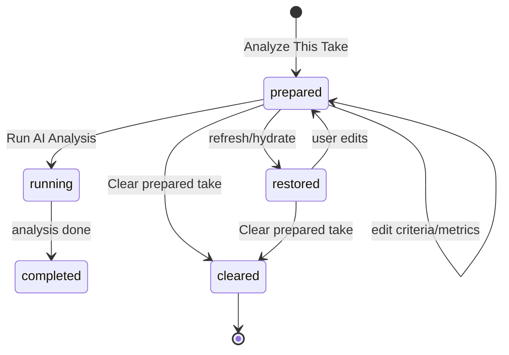

# Mission Take → Upload Analysis — durable handoff & cross-device audio

**Last updated:** 2026-08-04  
**Branch:** `dev`  
**Status:** Queued (P0)  
**Related:** Phase 2A Missions live recording (`227a55b`); Uploads media sprint [2026-06-27](./2026-06-27-uploads-multitrack-persistence-sprint.md)  
**Frozen baseline:** Phase 1 Items **1–8** + Item 8 CAS @ **`8ef698e`** — **consume** existing save/hydrate/CAS APIs; do not modify frozen paths or Item 8 diagnostics.

---

## Problem

Today `handoff_mission_take_to_upload_analysis` (`mission_upload_handoff.py`) stores the dry take and mission context in **session only** (`_analysis_prepared_upload`, `last_analysis_audio`, flags). Navigation to Upload Analysis works in-session, but:

- Browser refresh / Streamlit reboot loses the prepared take and often the active page intent.
- Another device on the same account/workspace cannot hydrate the same pending workflow.
- Large WAV bytes may ride the workspace envelope — unsuitable for cross-device and duplicate upload on reruns.

---

## Goal

After **Analyze This Take** on Missions:

| Surface | Expected |
|---------|----------|
| Same device | Upload Analysis active; dry take loaded; mission/chord/seal/metrics/criteria editable; **no auto AI run** |
| Refresh / reboot | Same prepared state restored |
| Dell → phone / phone → Dell | Pending handoff hydrates; user can edit criteria and run analysis on either device |
| Security | Workspace/account scoped; no cross-account leakage |
| CAS | Stale device cannot overwrite newer pending envelope |

---

## Non-goals

- Reopen Phase 1 Items 1–8 save/CAS implementation without `?dev=1` regression proof.
- Embed multi-MiB audio in workspace JSON.
- Auto-run AI analysis on handoff or hydrate.
- Analyze the mixed preview when authoritative source is **dry mic** (mixed is optional preview asset only).

---

## Architecture

### A. Authoritative pending envelope

Single canonical object (name TBD, e.g. `pending_upload_analysis_envelope` in mission workspace / creative workspace slice):

| Field | Purpose |
|-------|---------|
| `take_id` | Stable UUID for this prepared take |
| `handoff_revision` | Monotonic logical revision for CAS merge |
| `analysis_status` | `prepared` \| `running` \| `completed` |
| `active_destination_page` | `analysis` (Upload Analysis) |
| `source` | `mission_live_recording` |
| `capture_timestamp` | ISO UTC |
| `recording_seal` | From `improv_mission_recording_seal` / practice context |
| Mission identity | type, chord symbol, root/quality/extensions/slash, section, chord index |
| `dry_audio` | **Ref only:** asset id, storage path/key, fingerprint (SHA-256), duration, mime, byte size |
| `mixed_preview_audio` | Optional ref (same shape); labeled Performance + Backing preview |
| `inherited_ai_metric_ids` | From global AI Metrics at handoff |
| `additional_take_metric_ids` | Take-only additions |
| `effective_metric_ids` | Resolved set for scoring |
| `evaluation_criteria` / custom request | Editable pre-run |
| `criteria_edits` | Persist edits before Run AI |

Integrate with existing:

- `mission_upload_handoff.py` — handoff entry
- `mission_upload_metrics.py` — inherited + additional metrics
- `mission_analysis_ui.py` — Upload Analysis UI + `prepare_mission_upload_from_missions`
- `mission_practice_context.py` — seal + chord identity
- `music_persistent_state.py` / `suite_cloud_state.py` — envelope keys ( **metadata only** )
- `media_persistence.py` / `upload_media.py` — object storage upload dedupe by fingerprint
- Phase 1 CAS — same stale-device rules as Item 8 (fail-closed overwrite)

### B. Audio storage model

Align with Uploads + Multitrack sprint **Step C** where possible:

1. **Dry mic** = authoritative analysis source → Supabase Storage (or existing `music-media` channel) under workspace-scoped prefix.
2. **Mixed preview** (optional) → separate object + ref in envelope.
3. Upload once per fingerprint; skip re-upload if ref already exists for workspace.
4. On hydrate: signed URL or server-side fetch into session buffer for `st.audio` / Run AI only when needed.
5. Never persist raw bytes in cloud `full_session` blob for this path.

Label in UI:

- **Performance Only** — dry recording (analysis source)
- **Performance + Backing** — preview mix (non-authoritative unless user explicitly opts in later — default remains dry)

### C. Lifecycle

- Navigating away temporarily **must not** clear prepared state.
- Explicit **Clear prepared take** / **Start another take** removes envelope + optional tombstone for assets.

### D. Routing & hydrate

On app startup / cloud hydrate (after page gate known):

1. If envelope exists with `analysis_status=prepared` and `active_destination_page=analysis`:
   - Set studio page to Upload Analysis (respect user nav override only when explicit).
   - Load refs → session prepared upload (lazy audio fetch).
   - Restore metrics/criteria/seal/mission context via existing canonical apply paths.
2. Phone opens app → same envelope @ latest revision wins (CAS).

### E. `?dev=1` diagnostics (Upload Analysis + handoff write path)

Concise panel:

- `take_id`, `handoff_revision`
- dry / mixed asset fingerprint + storage ref
- `restored_source` (session \| cloud \| none)
- `active_destination_page`
- inherited / additional / effective metric ids
- persistence write result (ok \| cas_blocked \| skipped_unchanged)
- cross-device hydrate result

---

## Implementation order (isolated commits)

1. **Envelope schema + session adapter** — serialize/deserialize; no storage yet; tests for handoff fields.
2. **Dry audio upload + dedupe** — fingerprint gate; workspace-scoped storage; wire handoff to upload then store ref.
3. **Persist envelope in mission/creative workspace** — authoritative save on handoff + criteria edits; no blob in JSON.
4. **Hydrate + page routing** — refresh/reboot restore Upload Analysis prepared state.
5. **Cross-device** — Dell ↔ phone certification using CAS; stale overwrite blocked.
6. **Optional mixed preview asset** — separate object; UI labels; analysis still dry by default.
7. **Clear take + lifecycle** — explicit user action; tombstones.
8. **Dev diagnostics panel**.

**Do not modify** frozen Item 8 CAS internals — call existing save/compare/revision helpers.

---

## Acceptance tests (automated)

- `handoff_mission_take_to_upload_analysis` writes envelope + dry ref (mock storage).
- Same-device refresh restores Upload Analysis + prepared audio (fixture hydrate).
- App reboot simulation restores prepared state.
- Dell-prepared envelope visible on phone hydrate (fixture two-device).
- Phone → Dell symmetric.
- Mission/chord/seal/metrics/criteria survive round-trip.
- Take-only metrics do not mutate global AI Metrics canonical store.
- Dry vs mixed refs distinct; analysis pipeline receives dry by default.
- Duplicate handoff/rerun with same fingerprint → no second upload (mock counter).
- Workspace A cannot read workspace B asset refs.
- Stale revision save rejected; newer envelope preserved.
- Clear prepared take removes pending workflow.

Existing: `tests/test_mission_upload_handoff.py`, `tests/test_mission_upload_metrics.py` — extend, do not weaken.

---

## Manual live sign-off (after deploy)

1. Missions → Play → Record → Analyze This Take → Upload Analysis loaded.
2. Hard refresh → still on Upload Analysis with same take and metrics.
3. Edit criteria → refresh → edits kept.
4. Dell handoff → phone cold open → Upload Analysis + take + mission chord.
5. Phone edit criteria → Dell refresh → same edits.
6. Run AI on phone → completed status; clear take → pending gone.
7. `?dev=1` shows fingerprints and hydrate result.

---

## Notes

- Button copy may read **Analyze This Take** (UI) vs **Analyze This Mission Take** (product language) — same handoff path.
- Phase 2A live recording @ **`227a55b`** remains **pending live acceptance** until user sign-off; persistence sprint does not depend on 2A acceptance but should integrate with `improv_mission_live` dry bytes path.
