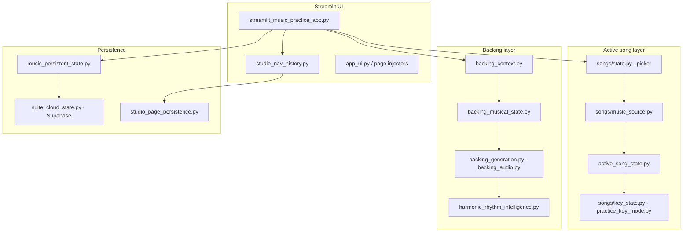

# Architecture — AI Music Practice Coach

Technical reference for module layout, persistence, and testing. For product overview and setup, see [README.md](../README.md).

---

## System overview

The app is a single Streamlit entry (`streamlit_music_practice_app.py`) that routes nine studio pages through shared session state. One **active song** (catalog, custom, or creative) flows through practice charts, backing synthesis, improvisation labs, and analysis tools. Key resolution and persistence are centralized so sidebar controls, charts, backing audio, and cloud restore stay aligned.



### Data flow (simplified)

1. **Song Selection** sets `pick_key` and activates a music source (catalog / custom / creative).
2. **Active song state** merges live session edits with canonical disk/cloud snapshots.
3. **Key resolvers** produce concert, written, shape, and fixed-family keys for charts and UI.
4. **Backing context** snapshots the active source (sections, BPM, groove, keys) for Backing Studio.
5. **Backing musical state** resolves live keys and chart mode at render/generation time.
6. **Persistence** autosaves globals + page snapshots; optional Supabase restores full workspace.

---

## Major modules

| Area | Modules | Responsibility |
|------|---------|----------------|
| **App shell** | `streamlit_music_practice_app.py`, `app_ui.py`, `studio_nav_history.py` | Page routing, layout, CSS, nav history |
| **Song catalog** | `song_catalog/` | Curated charts, search index, user overrides |
| **Music source** | `songs/music_source.py`, `music_source_ownership.py` | Catalog vs custom vs creative ownership and activation |
| **Key state** | `songs/key_state.py`, `practice_key_mode.py`, `instrument_transposition.py`, `guitar_capo.py` | Concert/written/shape/fixed-family resolution |
| **Backing** | `backing_context.py`, `backing_musical_state.py`, `backing_source_navigation.py` | Context snapshots, live resolver, page handoffs |
| **Audio** | `backing_audio.py`, `chord_subdivisions.py` | Bar-level synthesis, pushes, subdivisions |
| **Creative** | `custom_progression_lab.py`, `improvisation_intelligence_ui.py`, `creative_key_sync.py` | CPL + improv labs |
| **Analysis** | `recording_analysis.py`, `mission_analysis.py`, `multitrack_history.py` | Upload scoring, multitrack mixer |
| **Persistence** | `music_persistent_state.py`, `active_song_state.py`, `backing_track_state.py`, `practice_state.py` | Canonical state, autosave, cloud merge |
| **AMI / coaching** | `music_ami_context.py`, `practice_history_synthesis.py`, `applied_math_return_insight.py` | Context for AI and suite return handoffs |
| **Suite** | `suite_app_shell.py`, `suite_workspace.py`, `suite_auth.py` | Multi-app account, workspace, Command Center |

---

## Key resolvers

| Resolver | Used by | Purpose |
|----------|---------|---------|
| `resolve_active_musical_key` | Practice charts, active song cards | Concert / written / shape keys for display and transpose |
| `resolve_current_backing_musical_state` | Backing Studio, creative handoffs | Live practice concert key, chart badges, sections |
| `resolve_practice_concert_key_for_song` | Song load, fixed key mode | Per-song or fixed-family concert key |
| `apply_fixed_mode_target` | Identity changes, sidebar | Remap targets through fixed key family |

---

## Persistence model

### Globals (survive page navigation)

Instrument, level, practice focus, active song identity, display/concert key, transposing subtype, written-key toggle, capo settings, fixed practice key mode.

### Page-local snapshots (back/forward history)

Tab selection, backing scope and loops, creative widget state, improv entry mode, multitrack mixer UI, etc. Restored from `studio_page_persistence.py` without reverting global song/key state.

### Canonical flush modules

User edits flush to disk/cloud through dedicated modules:

- `active_song_state.py` — song identity, display key, instrument, written key
- `practice_state.py` — practice panel fields
- `backing_track_state.py` — backing BPM, scope, groove, meter
- `studio_nav_state.py` — current page

Envelope builder: `music_persistent_state.build_music_disk_state` → local JSON + optional Supabase via `suite_cloud_state.py`.

### Acceptance tests (frozen on `dev`)

Manual cross-device **Tests A–E** cover page sync, practice fields, backing content, active song + keys, and AMI return. Policy: do not modify persistence paths unless `?dev=1` trace proves regression.

See [MUSIC_PERSISTENCE_BASELINE.md](MUSIC_PERSISTENCE_BASELINE.md) and [MUSIC_PHASE_C_PROTOCOL.md](MUSIC_PHASE_C_PROTOCOL.md).

### Developer diagnostics

Append `?dev=1` to the app URL for persistence trace sidebar (Test D/E compare, cloud write metadata, workspace restore).

---

## Music source ownership

Three source families share one active-song pipeline:

| Source | Activation | Backing context |
|--------|--------------|-----------------|
| **Catalog** | Song Selection pick | `regular_song` |
| **Custom** | Custom Progression Lab | `custom_progression` |
| **Creative** | Creative Lab → Backing | `entry_jam`, `song_improv`, `mission` |

`music_source_ownership.py` coordinates transport authority, practice key resets, and catalog snapshots when switching between sources.

---

## Repository map

```
streamlit_music_practice_app.py   # Main Streamlit entry
song_catalog/                     # Curated songs + lyric charts
songs/                            # Picker state, keys, music source
backing_*.py / creative_*.py      # Backing + creative pipelines
practice_*.py / tuner_*.py        # Practice studio + tone
music_persistent_state.py         # Save/restore envelope
tests/                            # Pytest suite
cursor-prompts/                   # Roadmap and sprint plans
docs/                             # Persistence baseline, dev workflow, audits
```

---

## Testing

**1,242** automated tests collected (`python -m pytest tests/ --collect-only`). Four legacy collection errors exist in optional suite-integration files; the core music regression suite runs cleanly.

```bash
python -m pytest tests/ -q
```

Representative targeted suites:

```bash
python -m pytest tests/test_fixed_practice_key_mode.py -q
python -m pytest tests/test_backing_studio_live_updates.py -q
python -m pytest tests/test_active_song_state.py -q
python -m pytest tests/test_music_persistence_phase_c.py -q
```

Coverage areas: persistence simulations (v8–v19), backing musical state, fixed key mode, CPL, creative handoffs, practice log, media catalogs, navigation, and chart rendering.
