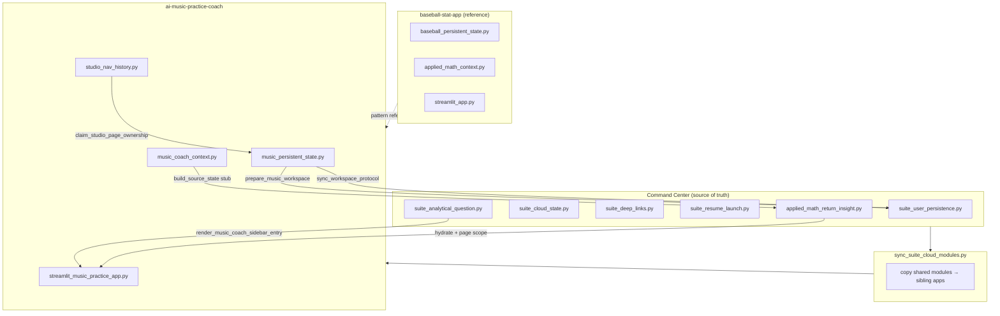

# Music Practice Coach — Phase B Protocol

**Last updated:** 2026-06-08  
**Status:** Phase B implemented — shared suite modules + workspace sync + Music Coach stub  
**Reference:** Baseball `baseball-sync-reference-v1`  
**Phase A audit:** `MUSIC_PHASE_A_AUDIT.md`

Phase B ports Baseball’s shared architecture **without** canonical `{page}_state.py` modules (Phase C).

---

## Architecture: Baseball → Music



---

## Baseball → Music mapping

| Baseball | Music Phase B |
|----------|---------------|
| `active_page` | `studio_page` + `_music_coach_workspace_page` |
| `prepare_baseball_workspace()` | `prepare_music_workspace()` |
| `baseball_workspace_state` | `music_workspace_state` |
| `claim_user_page_ownership(active_page)` | `claim_studio_page_ownership(studio_page)` |
| `applied_math_context.py` | `music_coach_context.py` (stub) |
| “Analyze with Applied Math” | “Ask the Music Coach” |
| “Applied Math Insight” card | “Music Coach Insight” card |
| `applied_math_send` force-save | `music_coach_send` force-save |

---

## Lifecycle (implemented)

```
Early startup (after catalog load)
  → prepare_music_workspace()           # first cloud/disk sync

Before sidebar (authoritative)
  → record_page_navigation_startup_diagnostics()
  → prepare_music_workspace()
  → show_persistence_messages()
  → finalize_ami_return_restore()
  → consume _navigate_to_studio_page (AMI return)

Sidebar nav click
  → navigate_studio_page()
  → claim_studio_page_ownership()       # blocks stale cloud page overwrite

After sidebar
  → force_save on studio_page change (reason=page_change)
  → render_music_coach_sidebar_entry()
  → hydrate_applied_math_insight_for_session("music")

Main content (before page dispatch)
  → render_suite_applied_math_insight() # page-scoped Music Coach card

End of run
  → autosave_music_state()
  → force_save if insight dirty
  → clear_music_workspace_autosave_block()
```

---

## `music_workspace_state` envelope

Attached inside disk/cloud blob by `build_music_disk_state()`:

| Field | Purpose |
|-------|---------|
| `schema_version` | `1` |
| `updated_at` | UTC ISO |
| `device_id` | `data/music_device_id.txt` |
| `save_reason` | autosave / page_change / music_coach_send / … |
| `page` | Coach page id (`practice`, `backing`, `custom`, `karaoke`) |
| `studio_page` | Raw sidebar page id |
| `pick_key` | Active song |
| `instrument` / `display_key` | Global practice context |

**Not yet canonical:** page filters remain in `_PERSIST_KEYS` + `_studio_page_snapshots` until Phase C.

---

## Page ownership

| Rule | Mechanism |
|------|-----------|
| Manual sidebar nav wins | `claim_studio_page_ownership()` → `claim_user_page_ownership()` |
| Workspace page key | `_music_coach_workspace_page` (coach id) |
| Cloud restore blocked | `_user_page_blocks_cloud_overwrite()` when owned ≠ cloud |
| User page preserved on apply | `apply_music_disk_state()` checks `_suite_page_user_nav` |
| Karaoke virtual page | `resolve_coach_source_page()` → `karaoke` when Voice + session active |

---

## Music Coach (stub — not Applied Math wording)

### Feature naming

| Surface | Label |
|---------|-------|
| Sidebar block | **Ask the Music Coach** |
| Return card | **Music Coach Insight** |
| Method line | **Coach guidance** |
| Continue card | **Music Coach question from Music Practice Coach** |

### Eligible coach pages (insight scoping)

| Coach page id | Product surface | Example question |
|---------------|-----------------|------------------|
| `practice` | Practice | “What should I practice next?” |
| `backing` | Backing Track Studio | “How should I set up the groove?” |
| `custom` | Creative Progression | “What scales work over this progression?” |
| `karaoke` | Karaoke (Voice on backing) | “How do I use this mode?” |

Insight card renders **only** when `resolve_coach_source_page(session)` matches insight `source_page`.

### `source_state` stub (Phase B)

`music_coach_context.build_source_state()` sends:

- `source_app`, `source_page`, `page_params`
- `entity_params`: pick_key, song title/artist
- `widget_params`: instrument, display_key, page-specific prefs (no canonical modules)

`apply_source_state_to_session()` stub restores coach page + light widget prefs; sets `_navigate_to_studio_page`.

---

## Deep link aliases (extended)

`suite_deep_links._MUSIC_STUDIO_ALIASES` maps human labels → `studio_page` ids:

- `backing track studio` → `backing`
- `recording analysis` / `recording` → `analysis`
- `practice log` → `log`
- `creative progression` → `custom`
- `song selection` / `songs` → `picker`

---

## Shared modules synced (Phase B)

From Command Center via `scripts/sync_suite_cloud_modules.py`:

- `suite_user_persistence.py` — `claim_user_page_ownership`, `sync_workspace_protocol`, `music_coach_send`
- `suite_cloud_state.py`
- `applied_math_return_insight.py` — `INSIGHT_ELIGIBLE_PAGES["music"]`, Music Coach card labels
- `suite_analytical_question.py` — `render_music_coach_sidebar_entry`, music copy
- `suite_deep_links.py` — extended music aliases
- `suite_resume_launch.py` — AMI insight on music resume, fixed `navigate_studio_page` import

---

## Acceptance criteria (Phase B)

| Goal | Test / verify |
|------|----------------|
| A. `studio_page` ownership | `test_music_phase_b.py::TestMusicPageOwnership` |
| B. Phone ↔ Dell page sync | `prepare_music_workspace` + envelope; manual `?dev=1` |
| C. No page bounce | `claim_studio_page_ownership` + user page preserve on apply |
| D. Cloud restore protection | `_user_page_blocks_cloud_overwrite` + sync skip test |
| E. Music Coach stub hydrate/render | `TestMusicCoachInsightScope` + manual eligible pages |

```bash
cd ai-music-practice-coach
python -m pytest tests/test_music_phase_b.py tests/test_suite_session_restore.py tests/test_studio_navigation.py -q
```

---

## Phase C gate (do not start until Phase B passes)

- `practice_state.py`, `backing_track_state.py`, `creative_state.py`, `karaoke_state.py`, `upload_state.py`
- Per-page dirty flags + `apply_cloud_*_if_allowed`
- Full `source_state` from canonical modules
- Manual phone ↔ Dell sign-off on all coach pages

---

## Related docs

- `MUSIC_PHASE_A_AUDIT.md`
- `MUSIC_PAGE_STATE_PROTOCOL_DRAFT.md` → superseded by this doc for Phase B
- `MUSIC_ACCEPTANCE_MATRIX_DRAFT.md` — update after Phase B sign-off
- `baseball-stat-app/docs/BASEBALL_PAGE_STATE_PROTOCOL.md`
